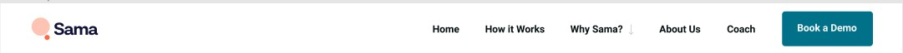

# web-client-sem2

.человек

.человек__голова.голова

.человек__тело.тело

.человек__руки.руки

.человек__ноги.ноги

.голова>.голова__брови.голова__брови--светлые+.голова__глаза.голова__глаза--карие+.голова__нос.голова__нос--прямой

.тело>.тело__одежда.тело__одежда--костюм

.руки>.руки__ногти.руки__ногти--маникюр+.руки__пальцы.руки__пальцы--кольца

.ноги>.ноги__обувь.ноги__обувь--кеды

  
header>nav.nav>(ul.nav__list>li.nav__item*5>a.nav__link)+img.nav_image+button.nav_button

  
form.form>(div.form_box>input.form_input)+button.form_button

  
div.card>(div.card_container>img.card_image)+(div.card_container>h4.card_title+h2.card_text+p.card_text)

    
div.advantages>h2.advantages_number+p.advantages_text

