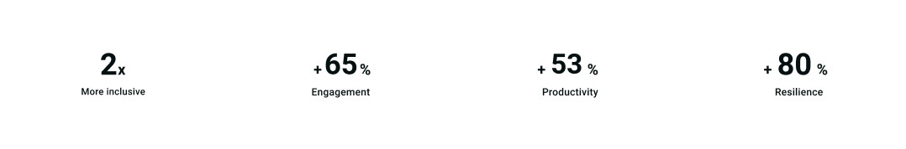

# web-client-sem2

.человек

.человек__голова.голова

.человек__тело.тело

.человек__руки.руки

.человек__ноги.ноги

.голова>.голова__брови.голова__брови--светлые+.голова__глаза.голова__глаза--карие+.голова__нос.голова__нос--прямой

.тело>.тело__одежда.тело__одежда--костюм

.руки>.руки__ногти.руки__ногти--маникюр+.руки__пальцы.руки__пальцы--кольца

.ноги>.ноги__обувь.ноги__обувь--кеды

  
header>nav.nav>img.nav__image+(ul.nav__list>li.nav__item*5>a.nav__link)+button.nav__button

  
form.form>(div.form__box>input.form__input)+button.form__button

  
div.card>img.card__image+(div.card__container>h4.card__title+h2.card__text+p.card__text)

    
div.advantages>(h2.advantages__number>span.advantages__text)+p.advantages__text

